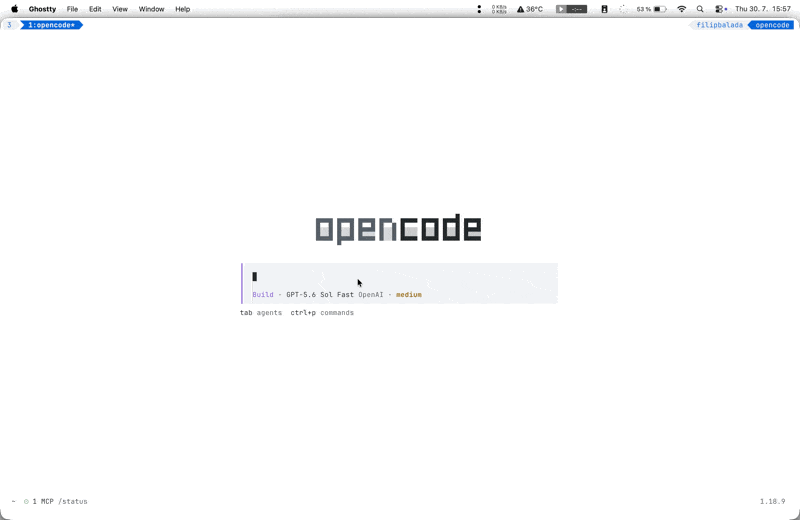

# OpenCode Skill Picker

A TUI plugin that adds a searchable skill picker to OpenCode.



## Use

1. Type `#` anywhere in an OpenCode prompt.
2. Search for a skill by name.
3. Select it to replace that `#` with `#skill-name` without moving or removing the surrounding text.

## How it works

The plugin only inserts the selected skill name into your prompt. OpenCode exposes the available skills to the LLM, which then decides whether to load and use the mentioned skill.

This approach works with the GPT-5.6 model family, but is slower than invoking an OpenCode skill directly. The prompt must first be sent to the LLM, which then considers whether to load the mentioned skill.

## Problem it solves

OpenCode lets you select a skill by typing `/` at the start of a prompt or by opening the Skills menu. If you select a skill after writing a long or multiline prompt, OpenCode can replace or submit the existing text, causing your draft to disappear. The built-in picker also selects one skill at a time, which makes combining several skills in one prompt difficult.

These UX issues are documented in OpenCode GitHub issues [#39376](https://github.com/anomalyco/opencode/issues/39376) and [#27578](https://github.com/anomalyco/opencode/issues/27578).

OpenCode Skill Picker avoids replacing or submitting your draft. It inserts `#skill-name` at the position where you typed `#`, including in the middle of a multiline prompt. You can repeat this to mention multiple skills before submitting.

## Configure

Requires OpenCode 1.18.4 or later.

Add the plugin to your OpenCode TUI config. Plugin options use the tuple form shown below:

- Globally: `~/.config/opencode/tui.json`
- For one project: `.opencode/tui.json`

### Direct binding

```json
{
  "$schema": "https://opencode.ai/tui.json",
  "plugin": [
    [
      "opencode-skill-picker",
      {
        "keybinds": {
          "skill_picker_open": "ctrl+k"
        }
      }
    ]
  ]
}
```

### Leader binding

```json
{
  "$schema": "https://opencode.ai/tui.json",
  "plugin": [
    [
      "opencode-skill-picker",
      {
        "keybinds": {
          "skill_picker_open": "<leader>k"
        }
      }
    ]
  ]
}
```

`<leader>k` is a sequence: press your configured leader, release it, then press `k`. OpenCode resolves `<leader>` from your TUI configuration and manages the sequence timeout and key consumption. The example uses `k` because `<leader>s` conflicts with OpenCode's default `status_view` binding.

### Multiple bindings

```json
{
  "$schema": "https://opencode.ai/tui.json",
  "plugin": [
    [
      "opencode-skill-picker",
      {
        "keybinds": {
          "skill_picker_open": ["ctrl+k", "<leader>k"]
        }
      }
    ]
  ]
}
```

Each configured binding opens the same picker flow. OpenCode handles binding conflicts using its normal keymap behavior.

No shortcut is enabled by default. Omit `keybinds.skill_picker_open` to leave the command unbound and available only through the command palette. A native comma-separated string can also define multiple bindings.

OpenCode installs the npm package automatically. Quit and restart OpenCode to load the plugin.
